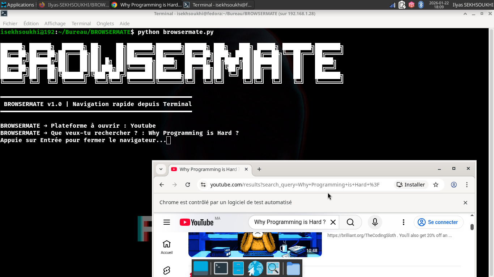

# BROWSERMATE
BROWSERMATE est un assistant web en CLI développé en Python qui permet d’ouvrir des plateformes web et d’effectuer des recherches automatiquement via Selenium, directement depuis le terminal.

<p align="center">
  
</p>

# 🚀 BROWSERMATE


**BROWSERMATE** est un assistant web en **ligne de commande (CLI)** écrit en **Python**.  
Il utilise **Selenium WebDriver** pour automatiser l’ouverture de plateformes web et écrire automatiquement dans les champs (recherches, messages, etc.) directement depuis le terminal.

---

## ✨ Features

- ✅ Ouvre automatiquement une plateforme web
- ✅ Recherche automatique sur **YouTube**
- ✅ Recherche automatique sur **Wikipedia (FR)**
- ✅ Envoi automatique d’un message sur **ChatGPT** *(connexion requise)*
- ✅ Interface simple et rapide dans le terminal
- ✅ Facile à étendre avec d’autres plateformes

---

## 🌍 Plateformes supportées

| Plateforme  | Action |
|------------|--------|
| YouTube     | Recherche |
| Wikipedia   | Recherche |
| ChatGPT     | Envoi de message |

⚠️ **Note ChatGPT :** tu dois être déjà connecté à ChatGPT sur ton navigateur, sinon le champ de texte peut ne pas être détecté.

---

## 📦 Prérequis

- Python **3.9+**
- Google Chrome
- Selenium

---

## ⚙️ Installation

### 1) Cloner le projet
```bash
git clone https://github.com/Ilyas-SEKHSOUKHI/BROWSERMATE.git
cd BROWSERMATE
