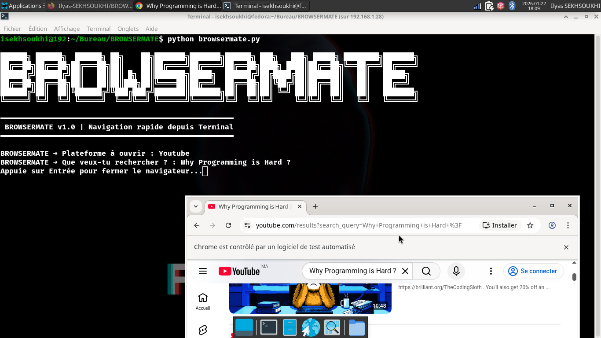

# BROWSERMATE

<p align="center">
  
</p>

# 🚀 BROWSERMATE


**BROWSERMATE** is a **command-line (CLI) web assistant** written in **Python**.  
It uses **Selenium WebDriver** to automate opening web platforms and automatically typing into input fields (searches, messages, etc.) directly from the terminal.

---

## 🎥 Demo Video

Watch the full demo of **BROWSERMATE** on YouTube:

👉 **https://www.youtube.com/watch?v=YOUR_VIDEO_ID**

[![BROWSERMATE Demo]](https://www.youtube.com/watch?v=tsjP-vVs9v0)

> Replace `YOUR_VIDEO_ID` with your actual YouTube video ID.

---

## ✨ Features

- ✅ Automatically opens a web platform
- ✅ Automatic search on **YouTube**
- ✅ Automatic search on **Wikipedia (FR)**
- ✅ Automatically sends a message to **ChatGPT** *(login required)*
- ✅ Simple and fast terminal interface
- ✅ Easy to extend with additional platforms

---

## 🌍 Supported Platforms

| Platform   | Action |
|-----------|--------|
| YouTube    | Search |
| Wikipedia  | Search |
| ChatGPT    | Send message |

⚠️ **ChatGPT note:** You must already be logged in to ChatGPT in your browser, otherwise the input field may not be detected.

---

## 📦 Requirements

- Python **3.9+**
- Google Chrome
- Selenium

---

## ⚙️ Installation

### 1) Clone the project
```bash
git clone https://github.com/Ilyas-SEKHSOUKHI/BROWSERMATE.git
cd BROWSERMATE
